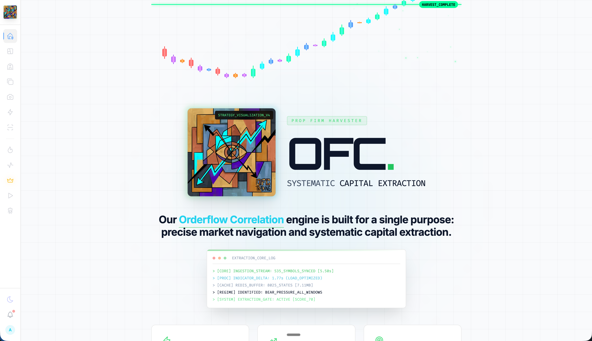
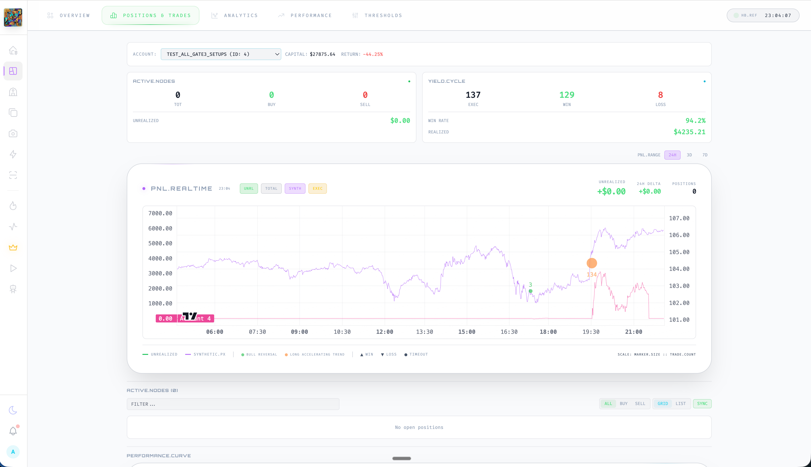
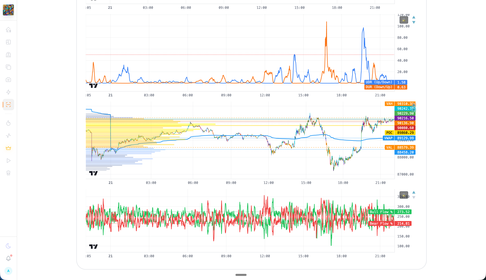
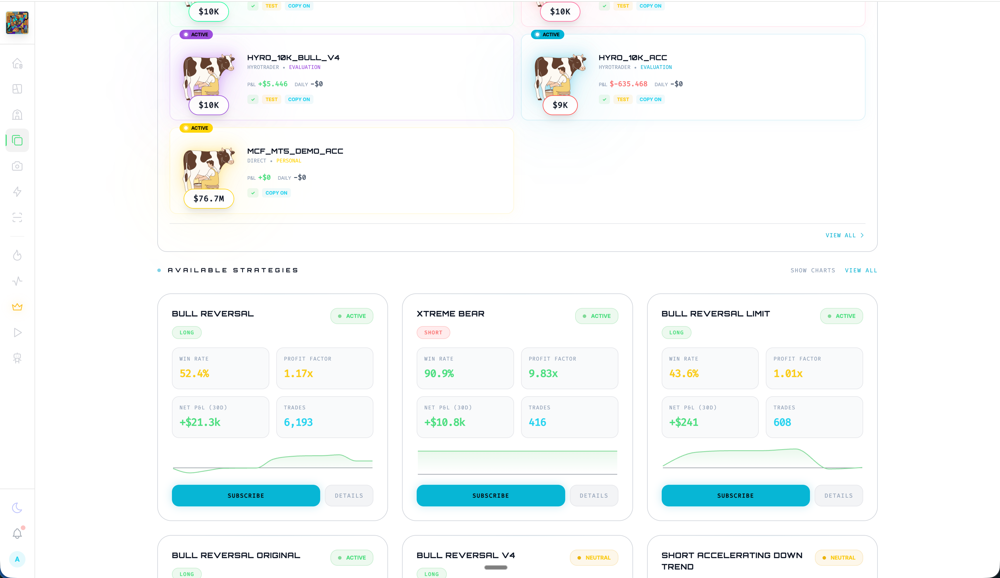
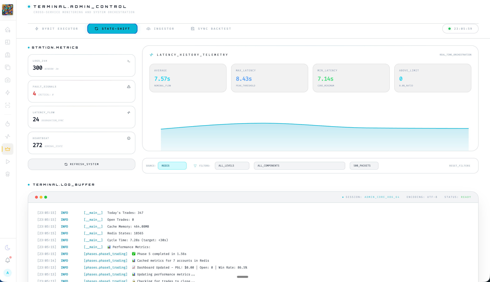
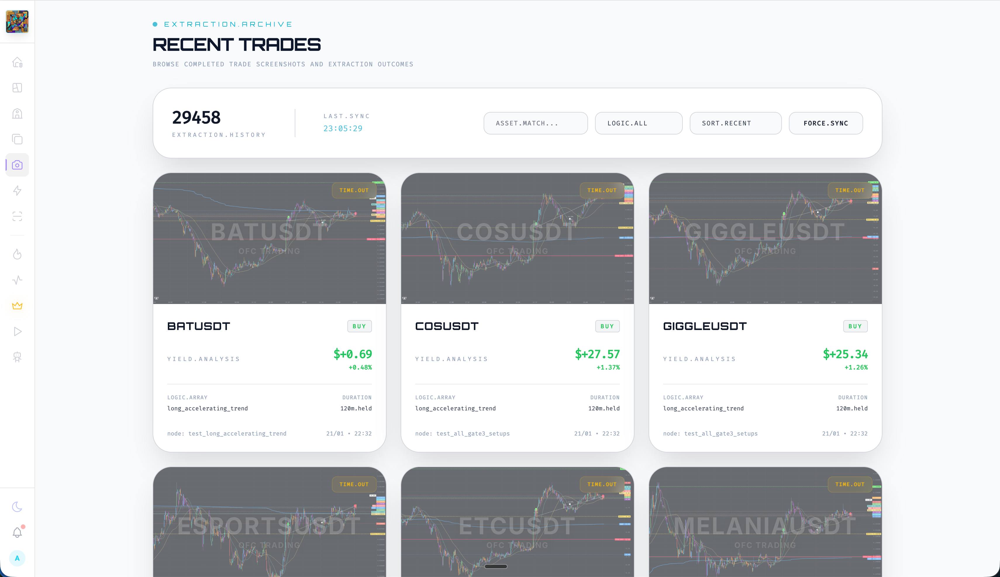

# OFC Trading Platform

A professional-grade cryptocurrency trading analytics platform providing real-time market insights, AI-powered analysis, and automated trading tools for futures markets.

**Live Demo:** [https://ofc-trading.xyz](https://ofc-trading.xyz)

---

## Tech Stack

### Frontend
- **Next.js 14** - React framework with SSR/SSG
- **TypeScript** - Type-safe development
- **Tailwind CSS** - Utility-first styling
- **Framer Motion** - Smooth animations
- **Recharts & Chart.js** - Data visualization
- **Lightweight Charts** - TradingView-style charts

### Backend
- **Next.js API Routes** - Server-side API endpoints
- **PostgreSQL** - Primary database
- **Prisma ORM** - Database management
- **Redis** - Real-time caching & pub/sub
- **BullMQ** - Background job processing

### Infrastructure
- **VPS (Dedicated Servers)** - Self-hosted deployment
- **PM2** - Process management & clustering
- **Nginx** - Reverse proxy & load balancing
- **Cloudflare** - CDN & DDoS protection
- **MinIO** - S3-compatible object storage for chart images
- **NextAuth.js** - Authentication
- **Stripe** - Subscription management

### Data & Analysis
- **Python/Flask** - Market data processing
- **WebSocket** - Real-time data streams
- **Bybit API** - Exchange integration

---

## Features

### Real-Time Trading Dashboard
- Live portfolio tracking with P&L visualization
- Active positions monitoring across multiple accounts
- Trade execution history with detailed metrics
- Equity curve analysis and performance statistics

### Market Analysis Tools
- **OFC Indicators** - Proprietary order flow correlation indicators
- **Market Scanner** - Cross-asset screening with customizable filters
- **Regime Detection** - Automated market condition classification
- **Consolidation & Breakout Alerts** - Real-time pattern recognition

### AI-Powered Features
- **AI Strategy Selector** - Machine learning-based strategy recommendations
- **Market Reports** - Automated daily/weekly analysis
- **Trading Signals** - Data-driven entry/exit suggestions
- **AI Agent Terminal** - Interactive market analysis assistant

### Copy Trading
- Follow professional trader accounts
- Automated position mirroring
- Risk-adjusted position sizing
- Performance tracking and analytics

### Portfolio Management
- Multi-account support (Bybit integration)
- Historical performance analytics
- Calendar view with daily P&L breakdown
- Symbol-level performance analysis

### Account & Subscription
- Tiered subscription plans
- Two-factor authentication (2FA)
- Email alert preferences
- Admin dashboard for user management

---

## Screenshots

### Landing Page


### Trading Dashboard


### Market Scanner


### OFC Indicators & Charts


### Copy Trading


### Monitoring Dashboard


### Recent Trades


---

## Architecture Overview

```
                    +------------------+
                    |   Cloudflare     |
                    |   (CDN & DNS)    |
                    +--------+---------+
                             |
                    +--------v---------+
                    |  Nginx Reverse   |
                    |      Proxy       |
                    +--------+---------+
                             |
                    +--------v---------+
                    |   Next.js App    |
                    |   (PM2 Managed)  |
                    +--------+---------+
                             |
          +------------------+------------------+
          |                  |                  |
+---------v------+  +--------v-------+  +------v--------+
|   PostgreSQL   |  |     Redis      |  |     MinIO     |
|  (Trade Data)  |  |  (Cache/PubSub)|  | (Chart Images)|
+----------------+  +----------------+  +---------------+
          |                  |
          |         +--------v--------+
          |         |     BullMQ      |
          |         | (Job Processing)|
          |         +--------+--------+
          |                  |
+---------v------------------v---------+
|       Data Processing Pipeline       |
|   (Python/Flask WebSocket Workers)   |
+--------------------------------------+
                    |
          +---------v---------+
          |  Exchange APIs    |
          |  (Bybit, Binance) |
          +-------------------+
```

### Key Components

- **Web Application** - Next.js frontend with SSR, managed by PM2 for high availability
- **API Layer** - RESTful endpoints handling authentication, data queries, and real-time updates
- **Data Pipeline** - Python workers processing market data, computing indicators, and generating alerts
- **Caching Layer** - Redis for real-time data caching, session management, and pub/sub messaging
- **Job Queue** - BullMQ handling background tasks like report generation and alert processing
- **Object Storage** - MinIO (S3-compatible) for chart images and screenshot storage
- **Database** - PostgreSQL for persistent trade data, user accounts, and market history

---

## Contact

Interested in learning more about the platform or exploring partnership opportunities?

**Email:** contact@ofc-trading.xyz

---

*Source code is private. Contact for more info.*
